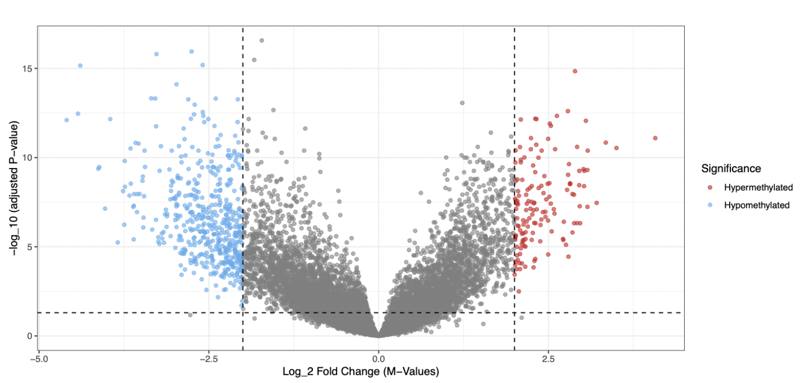

```{r setup, include=FALSE}
knitr::opts_chunk$set(echo = TRUE)
```

My portfolio includes both health- and sports-related projects. 

### Table of Contents
- [Biostatistics & Health](#biostatistics--health)
- [Baseball Analytics](#baseball-analytics)
- [Football Analytics](#football-analytics)

### 🧬 Biostatistics & Health {#biostatistics-health}

\newline
\newline

#### 1. DNA Methylation Analysis within the TCGA-BRCA Study



**Motivation**  
Are there systematic differences in DNA methylation between tumor tissue and healthy tissue in patients with breast cancer?

**Data & Methods**

- The Cancer Genome Atlas (TCGA-BRCA)

- Sample: 27 patients with matched tumor and healthy tissue

- Beta values for ~24,000 CpG sites per patient

**Key Results**

- PCA revealed clear separation between tumor and normal tissue samples

- After FDR adjustment, over 600 CpG sites exhibited significant hyper- or hypomethylation in tumor tissue

- No strong relationship was observed between differential methylation and genomic location

**Links:**
📄 [Final report (PDF)](Reports/dna_methylation_report.pdf) |
💻 [GitHub repository](https://github.com/jl7033/dna_methylation_project)

#### 2. Longitudinal Analysis of D-Penicillamine in Primary Biliary Cirrhosis

**Motivation**  
Does the copper chelating drug D-penicillamine lead to meaningful improvements over time in patients with primary biliary cirrhosis (PBC)?

**Data & Methods**

- Mayo Clinic (pbcseq dataset, R **survival** package)

- Response variable: serum bilirubin (mg/dL)

- Linear mixed model (random effects for each study participant)

- Fixed effects for clinical indicators of liver disease, blood clotting measures, and demographics

**Key Results**

- Serum bilirubin levels generally increased over time, consistent with progressive liver deterioration, and were associated with multiple clinical markers

- No statistically significant effect of D-penicillamine on serum bilirubin

- Findings are consistent with prior evidence indicating limited clinical benefit and increased risk of adverse outcomes, contributing to the discontinuation of the treatment in practice

**Links:**
📄 [Final report (PDF)](Reports/longitudinal_report.pdf) |
💻 [GitHub repository](https://github.com/jl7033/longitudinal_analysis)

#### 3. Building Machine Learning Models to Predict Incidence of Severe Flu

**Motivation**  
Which type of machine learning model is most effective with respect to predicting the risk of severe flu within six months of vaccination?

**Data & Methods**

- Columbia University (P8106: Data Science II course materials)

- Response: severe flu within six months of vaccination (binary)

- Predictors: demographic variables, smoking history, BMI, comorbidities (diabetes, hypertension), blood pressure, LDL cholesterol

- Supervised classification models: logistic regression, boosting, SVMs

- Model comparison using cross-validated AUC

**Key Results**

- Support vector machines with a linear kernel achieved the highest AUC, though performance differences across models were modest

- Logistic regression was selected as the final model to prioritize interpretability with minimal loss in predictive performance

- Current smoking status and higher BMI were associated with increased risk of severe flu

**Links:**
📄 [Final report (PDF)](Reports/ml_flu_analysis_report.pdf) |
💻 [GitHub repository](https://github.com/jl7033/machine_learning_flu_analysis)

### ⚾ Baseball Analytics

### 🏈 Football Analytics

